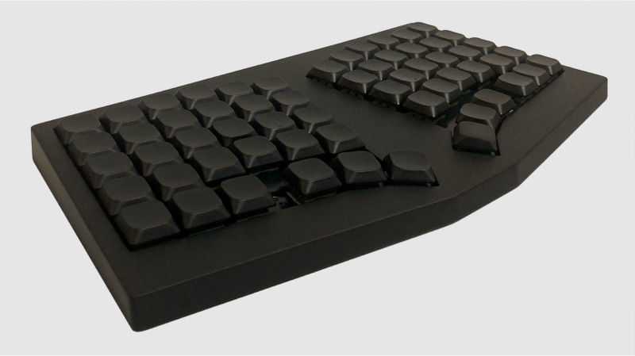
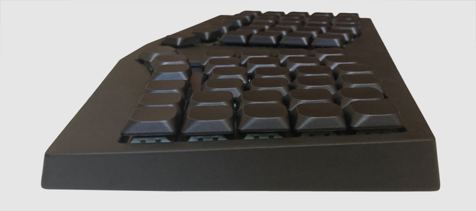
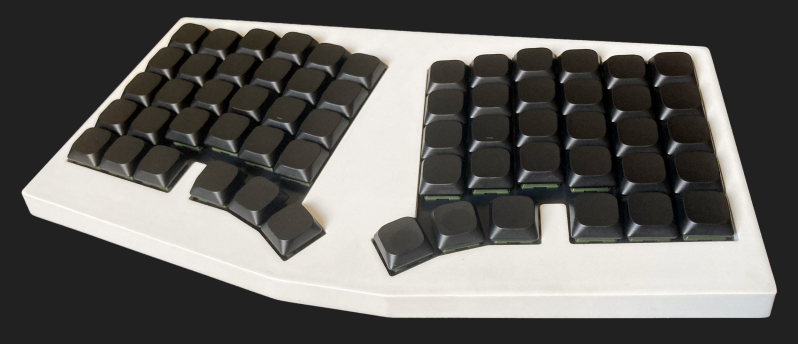
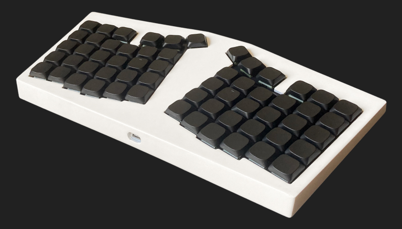

# Form Neo
> 5x12 low profile monoblock split keyboard.

Form Neo is a low profile, monoblock split keyboard inspired by the Cornelius by [foostan](https://github.com/foostan).

### Features
- Gasket-mounted.
- Hotswap PCB + daughterboard.
- Options for dedicated arrow keys.
- Clean and minimal design.

### DIY friendly
- Powered by an [RP2040 Tiny](https://www.waveshare.com/rp2040-tiny.htm) and [all the other parts](build) can be easily sourced.
- No tiny SMD components required!

## Build guide
See [build](/build)

## Sponsors
### JLCPCB

[JLCPCB](https://jlcpcb.com/?from=see) has always been my go-to for 3D printing and PCB manufacturing. They also provided the keyboard plate, 3D printed case, and PCB for this project. If you're looking to build your own board, I highly recommend their services.

### Beekeeb

The folks at [beekeeb](https://shop.beekeeb.com) were super nice and provided the switches and keycaps for this project. I haven't bought anything from them yet, but I've only heard good things from the community. If you're looking for keyboard kits/prebuilts/parts, definitely check them out!