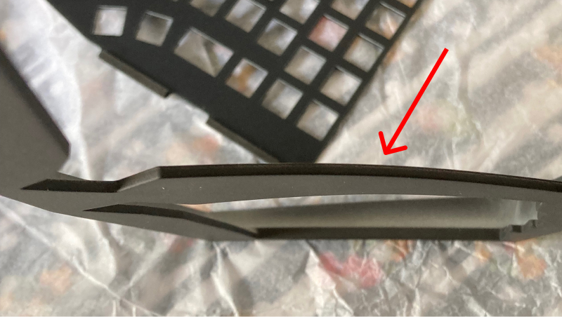

# Build Guide
> **IMPORTANT:** Be sure to go through the build guide, especially the [top case issues](#top-case-issues) section before ordering the parts.

If you have any questions, feel free to open an issue.

# The parts
- [3D printed case](./case)
- [RP2040 Tiny](https://www.waveshare.com/rp2040-tiny.htm)
- [PCB](./pcb-gerbers.zip)
    > **PCB thickness must be 1.6mm**
- [Plate](./plate-gerbers.zip)
    > **Plate thickness must be 1.2mm**
- 10 x M2 heat set inserts
    - [These inserts](https://www.aliexpress.com/item/1005003582355741.html) should work.
    - Select these options: `M2(OD 3.5mm)` and `Length 3mm`.
- 10 x M2x4mm screws
- 62 x kailh choc hotswap sockets
- 60 x 1N4148 diodes
    - The PCB supports both through hole and SMD diodes.
- 16 x poron gaskets
    - The case is designed to work with 40x4mm gaskets.
    - [Smaller gaskets also work](#install-the-gaskets), as long as they provide enough tension to securely hold the plate in place. 
    - [These gaskets](https://vi.aliexpress.com/item/1005004804533887.html) should fit the case.
    > **Just make sure the gaskets are 2mm thick.**

# Build the board
## Firmware
This repo doesn't include the firmware for the board. Here's the matrix pins so you can build your own using [QMK](https://github.com/qmk/qmk_firmware).

```json
"matrix_pins": {
    "cols": ["GP29", "GP28", "GP27", "GP26", "GP14", "GP15", "GP7", "GP8", "GP6", "GP5", "GP4", "GP3"],
    "rows": ["GP10", "GP11", "GP12", "GP13", "GP2"]
},
```

## Prepare the case
### Print the case
There are quite a few options when it comes to the case. For the material, you can choose either the FDM case or the resin case. I made the holes for the threaded inserts larger on the resin case so they can be installed with super glue or epoxy.

You also have the option to print the top case with or without blockers. By default, each half has three thumb keys, with a blocker separating the bottom keys.


Without the blocker, the innermost thumb key can be moved to the right.


### Install threaded inserts
You'll need to install 8 on the top case and 2 on the bottom case, where the daughterboard is mounted.

Keep in mind that you don't want to use a soldering iron to install the inserts if you have the resin case. Instead, use super glue or epoxy to hold the them in place.

## Solder the parts
Start by soldering the hotswap sockets and the diodes. If you're a beginner, I recommend going with the through-hole diodes, as they are much easier to work with than the SMD ones.

Next, solder the RP2040 Tiny to the PCB.


If you're unfamiliar with soldering castellated holes, check out [this video](https://www.youtube.com/watch?v=rGvvwXrv310).

## Install the switches
The board doesn't come with standoffs, so it might be a little tricky to install the switches. Watch [this video](https://www.youtube.com/watch?v=MtzzKFZqiPw&t=303s) if you're not sure how to do it properly.


## Install the gaskets

Install the gaskets (4x40mm) on the top and bottom case (there are 16 in total).


It's fine if you can't find gaskets in those exact dimensions. Smaller gaskets should also work.


## Assemble the board

Screw in the daughter board.


Connect the daughterboard to the PCB.


Place your PCB and plate assembly on top of the bottom case.


Screw in the top case and put on the keycaps. You're done!


# Top case issues
There are a few issues I encountered while building the board that I think people should be aware of.

### Warping
The 3D printed case I got from JLC warped in the middle, as you can see in the picture below.



Fortunately, I managed to fix this by following the instructions from [this video](https://www.youtube.com/watch?v=8zB2GCvbRnY).

### Spray Painting and Tolerances
Getting the tolerances right for spray painted parts is pretty tricky. I asked JLC to only paint the outer surface of the top case, and the part I got indeed had very little paint on the inside. Still, the holes for the threaded inserts ended up smaller than those on the unpainted bottom case.

I had to use my soldering iron on the lowest setting to push the inserts into the holes. This is not recommended and [you could ruin the case](https://www.youtube.com/watch?v=4nbvU2kGzxc&t=245s) this way.

### My Recommendations
- It's probably a good idea to mention the warping issue in the remarks section (if you're ordering from JLC), so the engineer reviewing the file can adjust the orientation and support to reduce the potential warping/deformation.
- I also recommend leaving the case unpainted (the [stl files](./case/) don't account for the extra thickness from the paint). If you still want to have it painted, you can find the step files [here](../src/case/) and adjust the tolerances yourself.